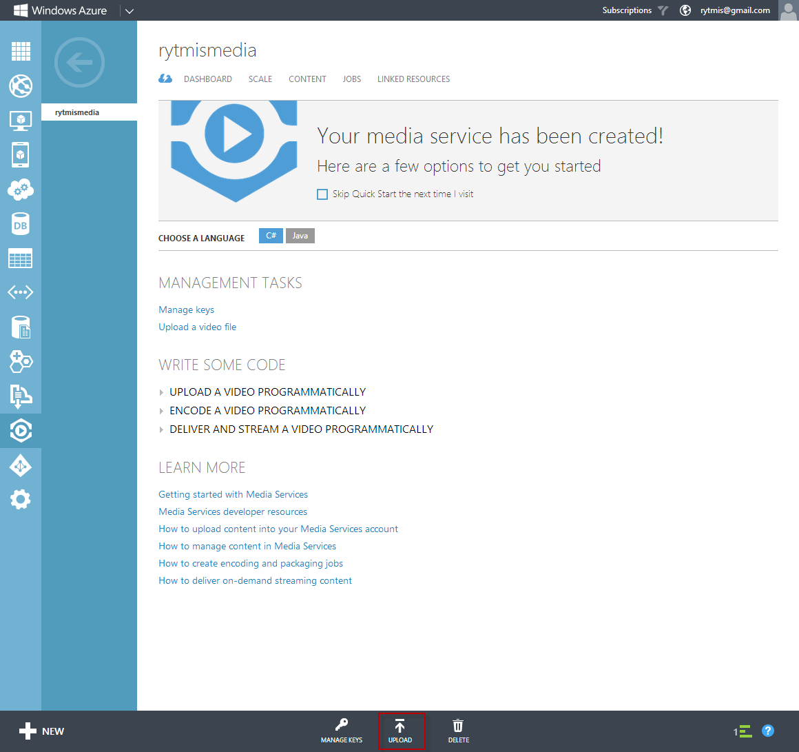
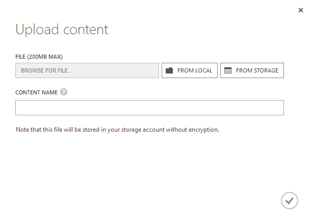

# Processing videos using the Management Portal #

## Prerequisites ##

In order to complete this lab, you will need a Windows Azure account.

## Creating a new Media Services account ##

Log in to the [Windows Azure Management Portal](https://manage.windowsazure.com) and select "Media Services" from the left.

Click on the button labeled + NEW:

A dialog for creating a new Media Service pops up:

Choose a unique name and a region for your Media Service. For the storage account, you may either create a new account or use an existing one.

Finish this step by clicking on Create Media Service.

The actual creation of a Media Service will take a while. Once it has completed, the Media Service will appear in your list:

You can now access your Media Service by clicking on its name.

## Uploading a video ##

Open the Media Service you just created by clicking on its name in the Media Services list. You will see the Media Service Quick Start screen. Click on the Upload button at the bottom of the screen:

A dialog for uploading a media file pops up:

Because uploading a large file takes a long time, we recommend that you use a small, local media file for this hands-on lab.

### Uploading a local file ###

If you have a media file that is smaller than 200 MB in size, you can use the From Local option. Browse for the file on your local computer, select it and give it a name:

Click on the check mark to begin the upload.

### Uploading a file from a storage account ###

If your media file is larger than 200 MB in size, you will have to upload it to a storage account first. In order to do that, you will need a client application such as [Azure Storage Explorer](http://azurestorageexplorer.codeplex.com/downloads/get/160100). 

Once the file is in a storage account, click the From Storage button.

A dialog for selecting a media file from a storage account pops up. Navigate to the file you wish to use, select it and click Open:

You will be taken back to the previous dialog. Add a name for your media file and click on the check mark to begin uploading the media file to your Media Service:

The upload process will take a while, depending on the size of your media file and whether you uploaded a local file or a file located in a storage account.

Once the upload is completed, your new Media Asset will appear on the Content tab of your Media Service:

## Encoding a video for Smooth Streaming ##

Go to the Content tab of your Media Service and select the Media Asset you uploaded in the previous step. Click on the Encode button in the bottom toolbar:

A dialog for selecting an encoding preset and a name for the resulting Media Asset pops up:

Type in a name for the resulting Media Asset and click on the check mark.

Once the encoder job has started, go to the Jobs tab to view the status of the encoder job:

The encoding job will take a while depending on the length and quality of your media asset and your selected encoding preset. A HD quality 10 minute video encoded with the Playback on PC/Mac (via Flash/Silverlight) preset takes approximately 20 minutes to encode.

## Publishing and playback ##

Once the encoding job has finished, go to the Content tab and select the new Media Asset. 
Click on Publish in the bottom toolbar and then click Yes in the confirmation box that pops up.

Click on Play in the bottom toolbar to test the playback.

That's it, you're done with the first hands-on lab! In the next part we will upload and encode a video asset using the Media Services API.