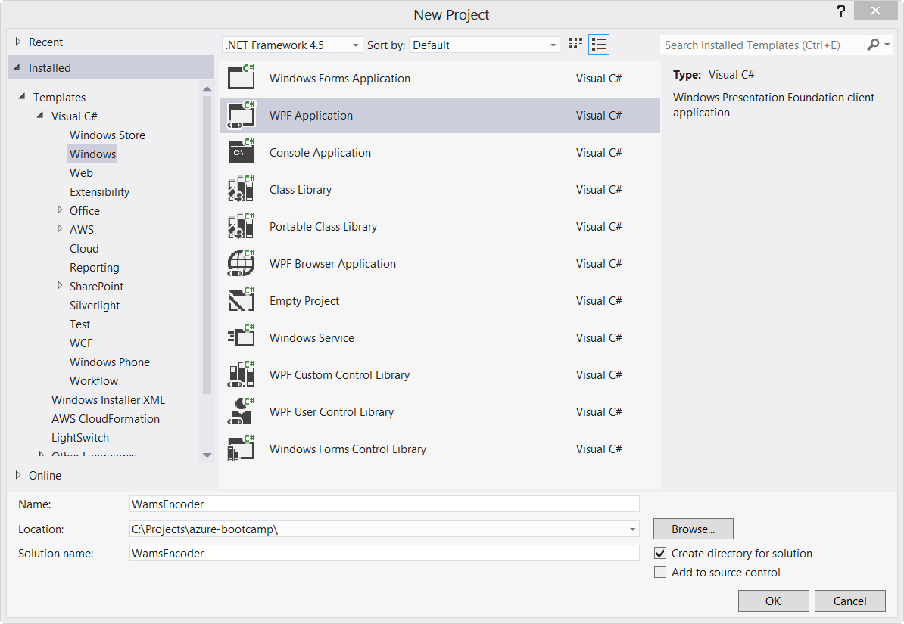
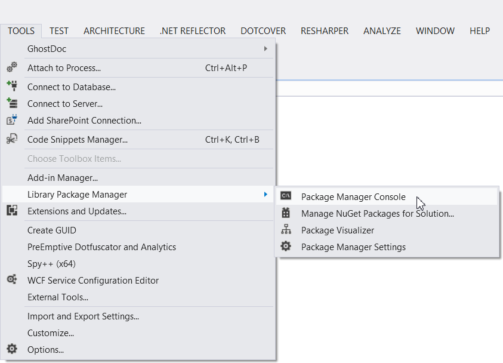
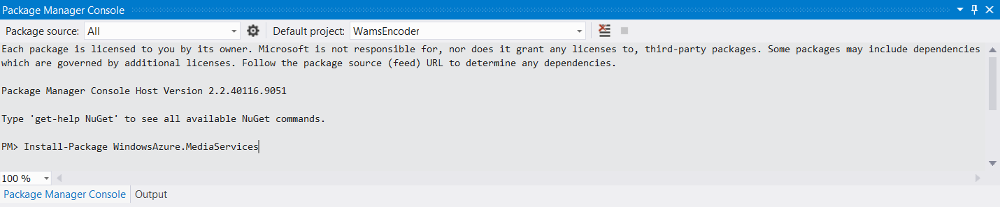
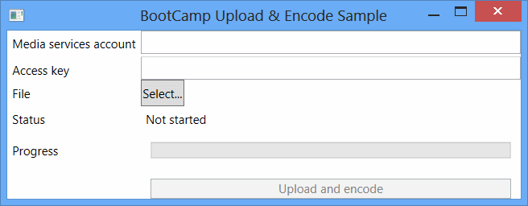
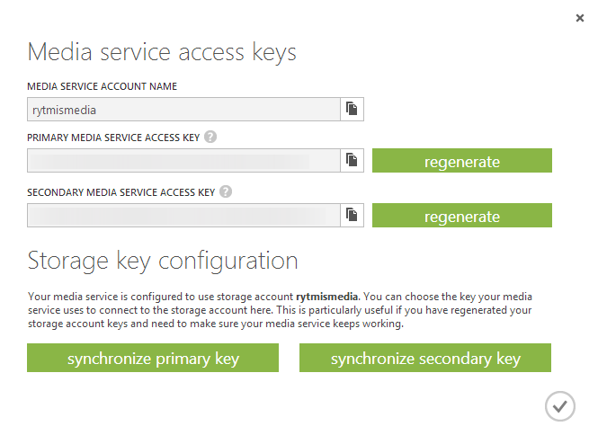
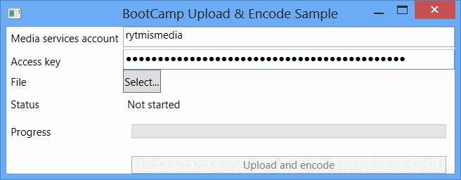
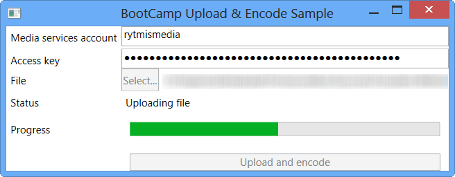
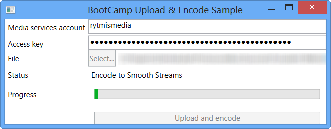

# Uploading and encoding media from a client application #

**NOTE: This lab involves using Media Services processor tasks to transcode videos. These tasks are billed at $1.99 / GB (in + out combined)**

## Prerequisites ##

+ Visual Studio 2012 (there is an [alternate version of the lab for Visual Studio 2010](02-client-application-vs2010.md))
+ Windows Azure SDK for .NET (VS 2012) 1.8.1
+ Windows Azure account

## Creating the project ##

Let's start by creating a new WPF application project. Open up Visual Studio, click on New Project and select Visual C# -> Windows -> WPF Application. Type in a name and file system location for your application and click OK:



## Adding the Media Services API ##

Now that you have the project skeleton ready, let's connect to Media Services.

Go to Tools -> Library Package Manager -> Package Manager Console:



Type in:

> Install-Package WindowsAzure.MediaServices -Version 2.0.1.1

and press enter:



The package manager will add the Media Services library along with any additional dependencies it might require.


## Wiring up the UI ##

Open up MainWindow.xaml and replace its contents with this bit of XAML:

```xml
<Window x:Class="WamsEncoder.MainWindow"
        xmlns="http://schemas.microsoft.com/winfx/2006/xaml/presentation"
        xmlns:x="http://schemas.microsoft.com/winfx/2006/xaml"
        Title="BootCamp Upload &amp; Encode Sample" Height="205" Width="525">
    <Grid>
        <Grid.RowDefinitions>
            <RowDefinition Height="Auto"/>
            <RowDefinition Height="Auto"/>
            <RowDefinition Height="Auto"/>
            <RowDefinition Height="Auto"/>
            <RowDefinition Height="Auto"/>
            <RowDefinition Height="Auto"/>
        </Grid.RowDefinitions>
        <Grid.ColumnDefinitions>
            <ColumnDefinition Width="Auto"/>
            <ColumnDefinition/>
        </Grid.ColumnDefinitions>
        <Label Grid.Column="0" Grid.Row="0" Content="Media services account" HorizontalAlignment="Left" VerticalAlignment="Top"/>
        <TextBox x:Name="AccountName" Grid.Column="1" Grid.Row="0" HorizontalAlignment="Left" Height="23" VerticalAlignment="Top" Width="378"/>
        <Label Grid.Column="0" Grid.Row="1" Content="Access key" HorizontalAlignment="Left" VerticalAlignment="Top" Grid.RowSpan="2"/>
        <PasswordBox x:Name="AccountKey" Grid.Column="1" Grid.Row="1" HorizontalAlignment="Left" Height="23" VerticalAlignment="Top" Width="378" />

        <Label Grid.Column="0" Grid.Row="2" Content="File" HorizontalAlignment="Left" VerticalAlignment="Top" Grid.RowSpan="2"/>
        <StackPanel Grid.Column="1" Grid.Row="2" Orientation="Horizontal">
            <Button x:Name="SelectFile" Click="SelectFileClicked">Select...</Button>
            <Label x:Name="FileName" Grid.Column="1" Grid.Row="2" Content="" HorizontalAlignment="Left" VerticalAlignment="Top" Grid.RowSpan="2"/>
        </StackPanel>

        <Label Grid.Column="0" Grid.Row="3">Status</Label>
        <Label x:Name="Status" Grid.Column="1" Grid.Row="3">Not started</Label>
        <Label Grid.Column="0" Grid.Row="4" Margin="0 5 0 0">Progress</Label>
        <ProgressBar x:Name="ProgressBar" Grid.Column="1" Grid.Row="4" Minimum="0" Maximum="100" Height="16" Margin="10 10 10 10" />

        <Button x:Name="UploadButton" Grid.Column="1" Grid.Row="5" Margin="10 10 10 10" IsEnabled="False" Click="BeginUpload">Upload and encode</Button>
    </Grid>
</Window>

```

Then, open up MainWindow.xaml.cs and replace its contents with this bit of C#:

```CSharp
using System;
using System.Collections.Generic;
using System.IO;
using System.Linq;
using System.Reflection;
using System.Threading;
using System.Threading.Tasks;
using System.Windows;
using Microsoft.Win32;
using Microsoft.WindowsAzure.MediaServices.Client;

namespace WamsEncoder {
	public partial class MainWindow {
		private string selectedFile;
		private static readonly string PackagerPreset = ReadPreset();

		public MainWindow() {
			InitializeComponent();
		}

		private static string ReadPreset() {
			var codebaseUri = new Uri(Assembly.GetEntryAssembly().CodeBase);

			var invocationDirectory = Path.GetDirectoryName(codebaseUri.LocalPath);

			var presetFilePath = Path.Combine(invocationDirectory, "PackagerPreset.xml");

			return File.ReadAllText(presetFilePath);
		}

		private void SelectFileClicked(object sender, RoutedEventArgs e) {
			var dialog = new OpenFileDialog();
			var result = dialog.ShowDialog();

			if (result == true) {
				selectedFile = dialog.FileName;

				FileName.Content = selectedFile;

				UploadButton.IsEnabled = true;
			}
		}

		private void DisableControls() {
			UploadButton.IsEnabled = false;
			SelectFile.IsEnabled = false;
		}

		private void EnableControls() {
			selectedFile = null;
			FileName.Content = null;
			SelectFile.IsEnabled = true;
		}

		private void SetStatus(string status) {
			Dispatcher.Invoke(() => {
				Status.Content = status;
				ProgressBar.Value = 0;
			});
		}

		private void UpdateProgress(double progress) {
			Dispatcher.Invoke(() => {
				ProgressBar.Value = progress;
			});
		}

		private static IMediaProcessor GetMediaProcessor(CloudMediaContext mediaContext, string name) {
			return mediaContext.MediaProcessors
								.Where(p => p.Name == name)
								.AsEnumerable()
								.OrderBy(p => p.Version)								
								.LastOrDefault();
		}

		private static readonly IEnumerable<JobState> FinishedStates = new List<JobState> {
			JobState.Finished,
			JobState.Error,
			JobState.Canceled,
			JobState.Canceling
		};
	}
}

```

That gives us a simple interface for wiring up our use of the Media Services API.

## Uploading and encoding media ##

Before we can do anything else, we need to connect to Media Services. Let's start by adding a method to MainWindow that will contain the upload and encode bits. Because we want to keep our UI responsive, let's make use of async support in C#:

```CSharp
private async Task<IJob> UploadAndConvertFile(string accountName, string accountKey, string filePath) {
	SetStatus("Connecting to Media Services");

	var mediaContext = new CloudMediaContext(accountName, accountKey);

	// We will add the next bits below this line
}
```

The next step is to create a media asset and add a new file to it:

```CSharp
SetStatus("Creating asset");

var assetName = Path.GetFileNameWithoutExtension(filePath);

var asset = await mediaContext.Assets.CreateAsync(assetName, AssetCreationOptions.StorageEncrypted, CancellationToken.None);

var fileName = Path.GetFileName(filePath);
var file = await asset.AssetFiles.CreateAsync(fileName, CancellationToken.None);
```

Next, we upload the file -- but before we do that, if we want to be notified of the upload progress, we add an event handler that takes care of it:

```CSharp
file.UploadProgressChanged += (o, args) => UpdateProgress(args.Progress);

SetStatus("Uploading file");

await Task.Run(() => file.Upload(filePath));
```

Note that IAssetFile also contains a method called UploadAsync we could use instead of wrapping the synchronous upload in a Task manually, but it's a bit more tedious to use.

Next, we create a new Media Services job:

```CSharp
SetStatus("Creating encoding job");

var job = mediaContext.Jobs.Create(string.Format("Convert {0} to Smooth Stream and HLS", assetName));
```

A job consists of a number of steps. Each step requires a media processor, input assets and output assets. As a first step, let's consume the file we just uploaded and convert it to Smooth Streaming.

```CSharp
var encoder = GetMediaProcessor(mediaContext, "Windows Azure Media Encoder");
var smoothStreamTask = job.Tasks.AddNew("Encode to Smooth Streams", encoder, "H264 Smooth Streaming 720p", TaskOptions.None);
smoothStreamTask.InputAssets.Add(asset);

var smoothStreamAsset = smoothStreamTask.OutputAssets.AddNew(assetName + " (Smooth Stream)", AssetCreationOptions.None);
```

Almost there! Now, all we need to do to finish the workflow is to convert the Smooth Streaming asset to HLS and return the resulting job:

```CSharp
var packager = GetMediaProcessor(mediaContext, "Windows Azure Media Packager");

var hlsTask = job.Tasks.AddNew("Package as HLS", packager, PackagerPreset, TaskOptions.None);
hlsTask.InputAssets.Add(smoothStreamAsset);
hlsTask.OutputAssets.AddNew(assetName + " (HLS)", AssetCreationOptions.None);

return job;
```

Now, at this point we've uploaded the file, but the encoding workflow has yet to be started.

## Wrapping it all up ##

It's time to bring it all together. Before the project will compile, we will have to implement the upload button's click handler. Let's start by disabling the UI controls and getting the contents of the credential fields. Add another new method to MainWindow:

```CSharp
private async void BeginUpload(object sender, RoutedEventArgs e) {
	DisableControls();

	var accountName = AccountName.Text;
	var accountKey = AccountKey.Password;

	// We will add the next bits below this line
}
```

We then invoke the method we wrote before:

```CSharp
var job = await UploadAndConvertFile(accountName, accountKey, selectedFile);

await job.SubmitAsync();
```

Now that the job has been submitted for processing, we'll add monitoring by way of starting a Task that will periodically refresh the media context and re-read the status of the job:

```CSharp
await Task.Run(() => {
	while(true) {
		Thread.Sleep(2500);

		// Recreating the context seems to be necessary in order to actually refresh all the entity data
		var mediaContext = new CloudMediaContext(accountName, accountKey);

		var refreshedJob = mediaContext.Jobs.Where(j => j.Id == job.Id).AsEnumerable().FirstOrDefault();
		if (refreshedJob == null) { continue; }

		if (FinishedStates.Contains(refreshedJob.State)) {
			break;
		}

		var currentTask = refreshedJob.Tasks.FirstOrDefault(t => t.State == JobState.Processing);
		if (currentTask == null) { continue; }

		SetStatus(currentTask.Name);
		UpdateProgress(currentTask.Progress);
	}
});
```

The task will run until the job has completed, at which point we can finish up:

```CSharp
SetStatus("Finished");

EnableControls();
```

That's it for the program code. There's one last thing to do before we can run this thing: add the configuration for the Windows Azure Media Packager task.

Add a new XML file to the project. Call it PackagerPreset.xml and paste in this bit here:

```xml
<taskDefinition xmlns="http://schemas.microsoft.com/iis/media/v4/TM/TaskDefinition#">
	<name>Smooth Streams to Apple HTTP Live Streams</name>
	<id>A72D7A5D-3022-45f2-89B4-1DDC5457C111</id>
	<description xml:lang="en">Converts on-demand Smooth Streams encoded with H.264 (AVC) video and AAC-LC audio codecs to Apple HTTP Live Streams (MPEG-2 TS) and creates an Apple HTTP Live Streaming playlist (.m3u8) file for the converted presentation.</description>
	<inputDirectory></inputDirectory>
	<outputFolder>TS_Out</outputFolder>
	<properties namespace="http://schemas.microsoft.com/iis/media/AppleHTTP#" prefix="hls">
		<property name="maxbitrate" required="true" value="1600000" helpText="The maximum bit rate, in bits per second (bps), to be converted to MPEG-2 TS. On-demand Smooth Streams at or below this value are converted to MPEG-2 TS segments. Smooth Streams above this value are not converted. Most Apple devices can play media encoded at bit rates up to 1,600 Kbps."/>
		<property name="manifest" required="false" value="" helpText="The file name to use for the converted Apple HTTP Live Streaming playlist file (a file with an .m3u8 file name extension). If no value is specified, the following default value is used: &lt;ISM_file_name&gt;-m3u8-aapl.m3u8"/>
		<property name="segment" required="false" value="10" helpText="The duration of each MPEG-2 TS segment, in seconds. 10 seconds is the Apple-recommended setting for most Apple mobile digital devices."/>
		<property name="log"  required="false" value="" helpText="The file name to use for a log file (with a .log file name extension) that records the conversion activity. If you specify a log file name, the file is stored in the task output folder." />
		<property name="encrypt"  required="false" value="false" helpText="Enables encryption of MPEG-2 TS segments by using the Advanced Encryption Standard (AES) with a 128-bit key (AES-128)." />
		<property name="pid"  required="false" value="" helpText="The program ID of the MPEG-2 TS presentation. Different encodings of MPEG-2 TS streams in the same presentation use the same program ID so that clients can easily switch between bit rates." />
		<property name="codecs"  required="false" value="false" helpText="Enables codec format identifiers, as defined by RFC 4281, to be included in the Apple HTTP Live Streaming playlist (.m3u8) file." />
		<property name="backwardcompatible"  required="false" value="false" helpText="Enables playback of the MPEG-2 TS presentation on devices that use the Apple iOS 3.0 mobile operating system." />
		<property name="allowcaching"  required="false" value="true" helpText="Enables the MPEG-2 TS segments to be cached on Apple devices for later playback." />
		<property name="key"  required="false" value="" helpText="The hexadecimal representation of the 16-octet content key value that is used for encryption." />
		<property name="keyuri"  required="false" value="" helpText="An alternate URI to be used by clients for downloading the key file. If no value is specified, it is assumed that the Live Smooth Streaming publishing point provides the key file." />
		<property name="overwrite"  required="false" value="true" helpText="Enables existing files in the output folder to be overwritten if converted output files have identical file names." />
	</properties>
	<taskCode>
		<type>Microsoft.Web.Media.TransformManager.SmoothToHLS.SmoothToHLSTask, Microsoft.Web.Media.TransformManager.SmoothToHLS, Version=1.0.0.0, Culture=neutral, PublicKeyToken=31bf3856ad364e35</type>
	</taskCode>
</taskDefinition>
```

Select the file in Solution Explorer, set its Type to Content and Build Action to Copy If Newer.

Phew! That's it, you can now run the application. Hit F5, and if all goes well, you should see the totally gorgeous UI:



To try it out, you will need to provide your Media Services account name and access key first. You can get them from the Management Portal, by going to your Media Service and clicking on Manage Keys in the bottom toolbar:


Clicking on the button will pop up a dialog that displays the name of your account along with your primary and secondary access key:



Copy the account name and primary access key to the application:



Click on the button labeled Select... and locate a file you want to upload and encode. Then hit the Upload and encode button, and watch the magic happen:




